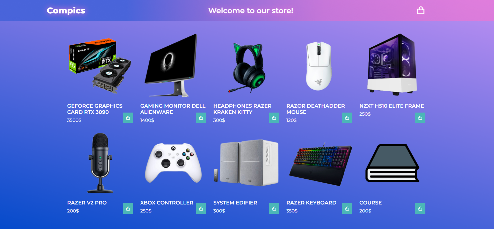
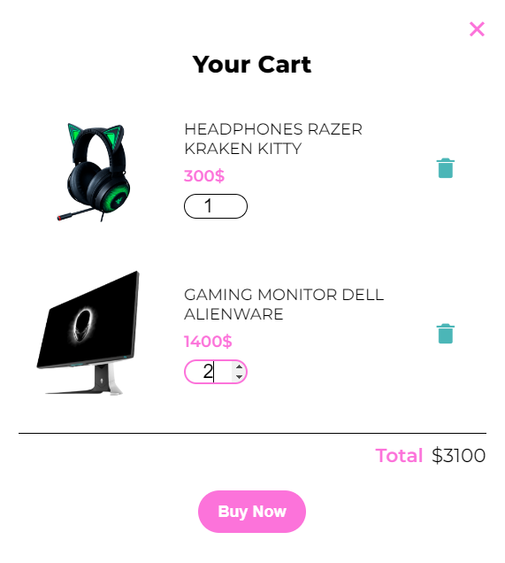
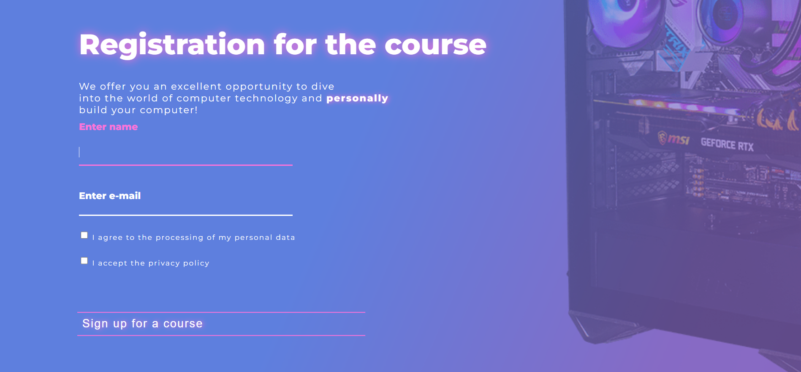

# Gaming Computer Assembly Courses

--- 
The project involves a site for enrolling clients in courses on assembling gaming PCs.

The layout of the site was made in the Figma editor.

In total, the site has 6 blocks:
  + Information
  + Accessories
  + Registration for the course
  + Contacts
  + Authorization/registration
  + Shop

Initially, the client gets to the home page of the site, where, for ease of use,
chooses for himself how best to move between blocks - a consequence of the swipe down
or by choosing on the header of the site.

    Home page + header
The screenshot below shows the start page to which the user
hit when the site loads.

The main functionality of this page is site navigation and content.
general information on the topic. An active "Order Now" button redirects the user
to the block of information about the course. The slider at the bottom contains general information about the pros of having a powerful computer.
User authorization is performed after pressing the button with the "user" icon.

    Authentication.
User authentication is implemented by a window with a choice of the desired action - registration or authorization.
Login window:

Registration window:

Changing the authentication mode is accompanied by a smooth movement of the GIF and the field to be filled in places.
Using the authentication tab as an example, the site icon looks like this:

    Information page.
The main activity is hints.

When you click on the "+" sign, a tooltip appears. In this screenshot, all hints are active.

    Catalog page - shop.
This page displays a summary of the products presented in the store.
Click on the "Go to store" button to go to the store.

After pressing the button, you will be redirected to the store page. There you can directly select the product,
and add it to cart. Clicking on the compics text will take you to the main page.

The basket is pulled out when you click on the package icon on the right side. When adding
a new product that is already in the cart, the user will receive a notification.
The quantity of goods can be increased in the basket itself. When you click on the buy button, the contents of the basket 
will be reset to zero, and you will also receive a notification about the purchase of the contents of the basket. 
The cart layout is shown below.

    Registration page for the course + contacts (footer).
This page contains user registration for computer assembly courses.
The user is required to be authorized on the site, as well as fill out a small registration form for the course.

The site footer is implemented in its classic view. It contains the company logo and contacts.

