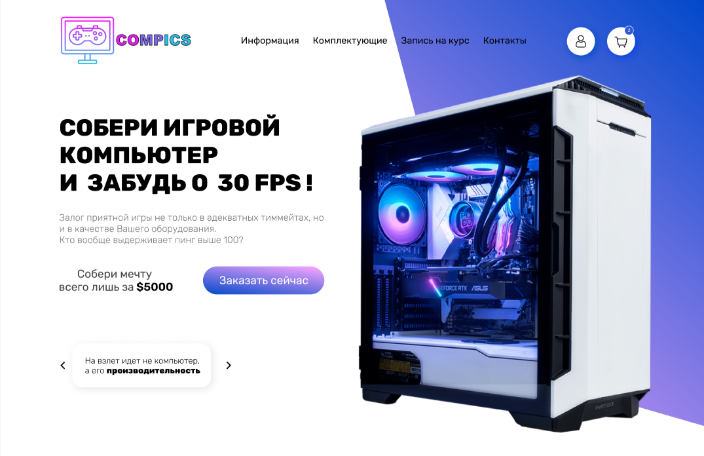
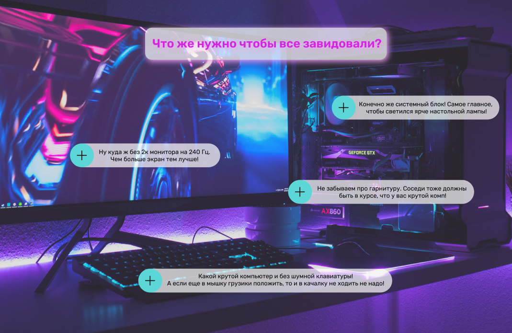

# Курсы сборки игровых компьютеров

--- 
Проект предполагает собой сайт для записи клиентов на курсы по сборке игровых ПК.

Макет сайта выполнен в редакторе Figma.

Первоначально клиент попадает на стартовую страницу сайта, где уже по удобству пользования
выбирает для себя как лучше передвигаться между блоками - последствием свайпа вниз
или выбором на шапке сайта. 

Всего сайт имеет 6 блоков:
  + Информация
  + Комплектующие
  + Запись на курс
  + Контакты
  + Авторизация/регистрация
  + Корзина

    Домашняя страница. 
На скрине ниже изображена стартовая страница, на которую пользователь
попадает при загрузке сайта. 

Основная функциональность данной страницы заключается в навигации по сайту и содержании
общей информации по теме. Активная кнопка "Заказать сейчас" перенаправляет пользователя
на блок информации про курс. Слайдер внизу содержит общую информацию о плюсах иметь мощный компьютер.

Авторизация пользователя выполняется после нажатия на кнопку с иконкой "user".
Кнопка корзины при нажатии покажет содержимое корзины.

    На данном этапе можно обозначить основной функционал сайта.
Пользователь заходит в раздел "комплектующие", где выбирает желаемые и добавляет в корзину.
После при оплате товаров в корзине предоставляется возможность записаться на курс, поставив галочку
напротив соответствующего поля. При этом стоимость курса автоматически добавиться к имеющейся в корзине.
Остальные блоки, а именно "Контакты" и "Информация" выполняют лишь функцию информатора.

    Информационная страница.
Основная активность - подсказки. 

При нажатии на знак "+" подсказка появляется. На данном скриншоте все подсказки активны.