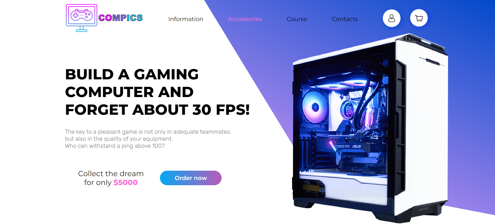
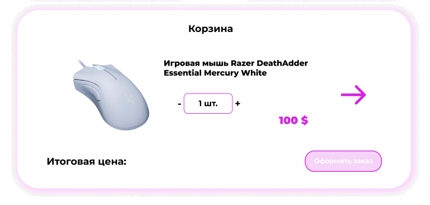
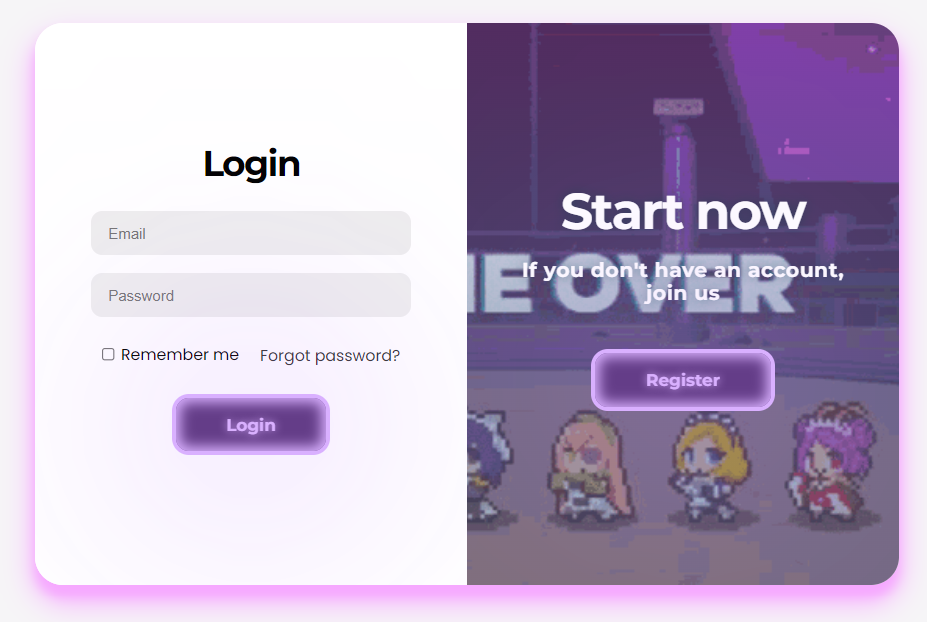
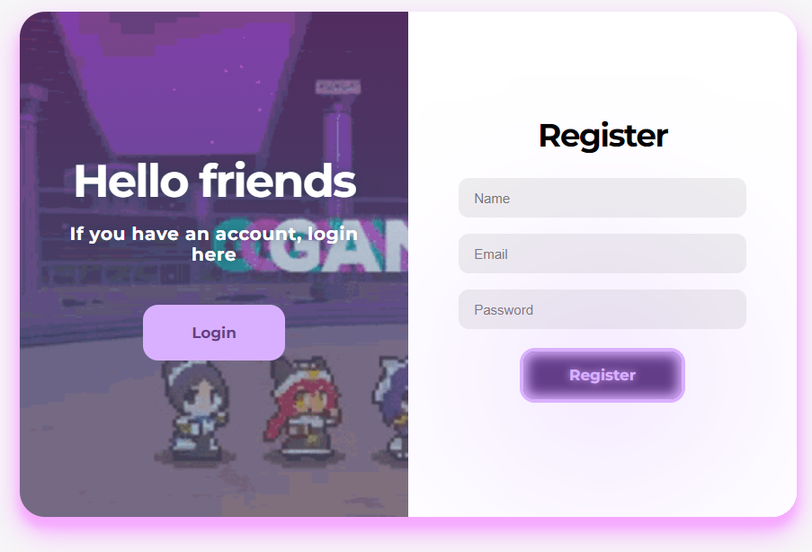
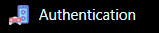
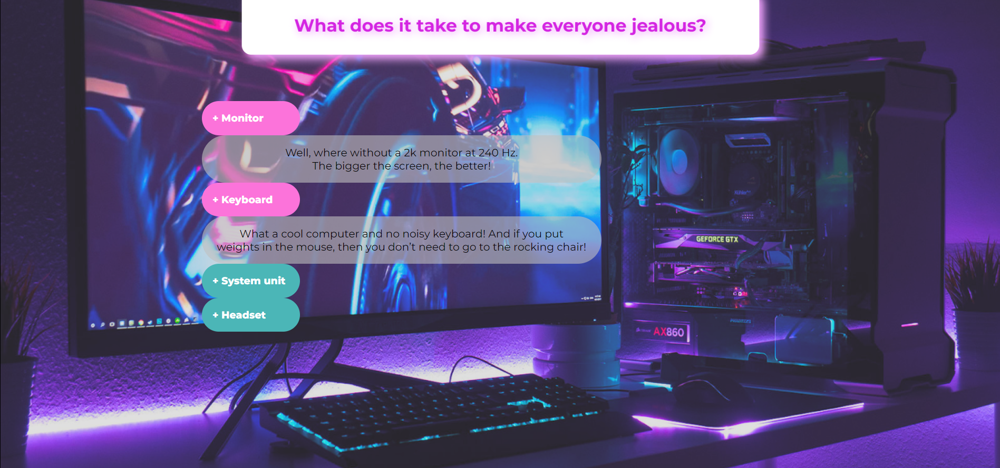
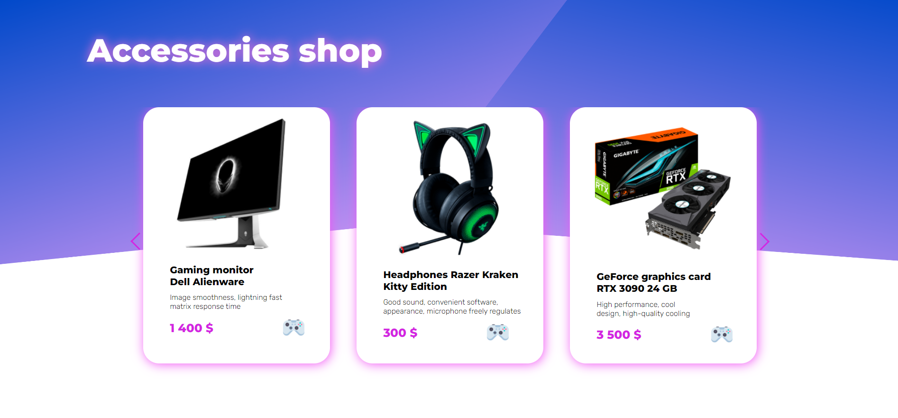
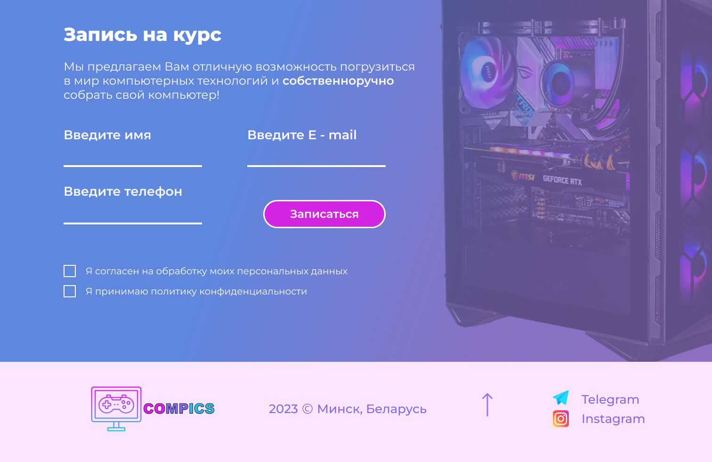

# Курсы сборки игровых компьютеров

--- 
Проект предполагает собой сайт для записи клиентов на курсы по сборке игровых ПК.

Макет сайта выполнен в редакторе Figma.

Всего сайт имеет 6 блоков:
  + Информация
  + Комплектующие
  + Запись на курс
  + Контакты
  + Авторизация/регистрация
  + Корзина

Первоначально клиент попадает на стартовую страницу сайта, где уже по удобству пользования
выбирает для себя как лучше передвигаться между блоками - последствием свайпа вниз
или выбором на шапке сайта. 

    Домашняя страница + header 
На скрине ниже изображена стартовая страница, на которую пользователь
попадает при загрузке сайта. 

Основная функциональность данной страницы заключается в навигации по сайту и содержании
общей информации по теме. Активная кнопка "Заказать сейчас" перенаправляет пользователя
на блок информации про курс. Слайдер внизу содержит общую информацию о плюсах иметь мощный компьютер.

Авторизация пользователя выполняется после нажатия на кнопку с иконкой "user".
Кнопка корзины при нажатии покажет содержимое корзины.

    На данном этапе можно обозначить основной функционал сайта.
Пользователь заходит в раздел "комплектующие", где выбирает желаемые и добавляет в корзину.
Предоставляется возможность записи на курс на отдельном блоке сайта (при этом стоимость курса при регистрации на него
автоматически добавится в общую стоимость корзины).

На скриншоте выше продемонстрирован макет всплывающего окна корзины.

    Аутентификация.
Аутентификация пользователя реализована окном с выбором желаемого действия - регистрации или авторизации.
Окно входа в систему:

Окно регистрации: 

Смена режима аутентификации сопровождается плавным перемещением местами гифки и заполняемого поля.
На примере вкладки аутентификации иконка сайта выглядит следующим образом:

    Информационная страница.
Основная активность - подсказки. 

При нажатии на знак "+" подсказка появляется. На данном скриншоте все подсказки активны.
Примечание: чтобы надпись сверху не обрезалась на устройствах типа MacBook Pro, островок с заглавием 
реализован немного вытянутым вниз. 

    Страница каталога - магазина.
Данная страница представляет собой магазин комплектующих, которые можно приобрести (добавить
в корзину). Для этого нужно нажать на значок джойстика.

Также присутствует возможность выбора категории нужного устройства.
Основное содержание страницы - краткая информация о приобретаемых товарах.

    Страница записи на курс + контакты(footer).
На этой странице находится регистрация пользователя на курсы по сборке компьютера. 
От юзера требуется быть авторизированным на сайте, а так же заполнить небольшую форму-регистрацию на курс.

Футер сайта реализован в классическом его представлении. На нем располагаются логотип компании и контакты.
