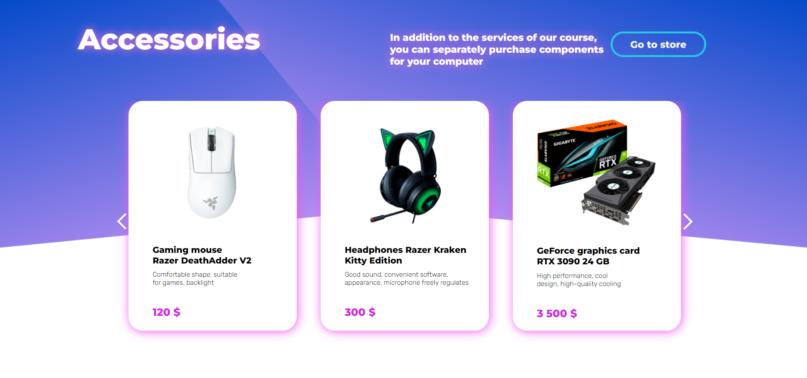

# Gaming Computer Assembly Courses

--- 
The project involves a site for enrolling clients in courses on assembling gaming PCs.

The layout of the site was made in the Figma editor.

In total, the site has 6 blocks:
  + Information
  + Accessories
  + Registration for the course
  + Contacts
  + Authorization/registration
  + Basket

Initially, the client gets to the home page of the site, where, for ease of use,
chooses for himself how best to move between blocks - a consequence of the swipe down
or by choosing on the header of the site.

    Home page + header
The screenshot below shows the start page to which the user
hit when the site loads.

The main functionality of this page is site navigation and content.
general information on the topic. An active "Order Now" button redirects the user
to the block of information about the course. The slider at the bottom contains general information about the pros of having a powerful computer.
User authorization is performed after pressing the button with the "user" icon.
The cart button, when clicked, will show the contents of the cart.

    At this stage, you can identify the main functionality of the site.
The user enters the "components" section, where he selects the desired ones and adds them to the basket.
It is possible to enroll in a course on a separate block of the site (at the same time, the cost of the course when registering for it
automatically added to the total cost of the basket).

The screenshot above shows the cart popup layout.

    Authentication.
User authentication is implemented by a window with a choice of the desired action - registration or authorization.
Login window:

Registration window:

Changing the authentication mode is accompanied by a smooth movement of the GIF and the field to be filled in places.
Using the authentication tab as an example, the site icon looks like this:

    Information page.
The main activity is hints.

When you click on the "+" sign, a tooltip appears. In this screenshot, all hints are active.

    Catalog page - shop.
This page is a store of accessories that can be purchased (add to cart). To do this, click on the joystick icon.

There is also an option to select the category of the desired device.
The main content of the page is a brief information about the purchased goods.

    Registration page for the course + contacts (footer).
This page contains user registration for computer assembly courses.
The user is required to be authorized on the site, as well as fill out a small registration form for the course.

The site footer is implemented in its classic view. It contains the company logo and contacts.

